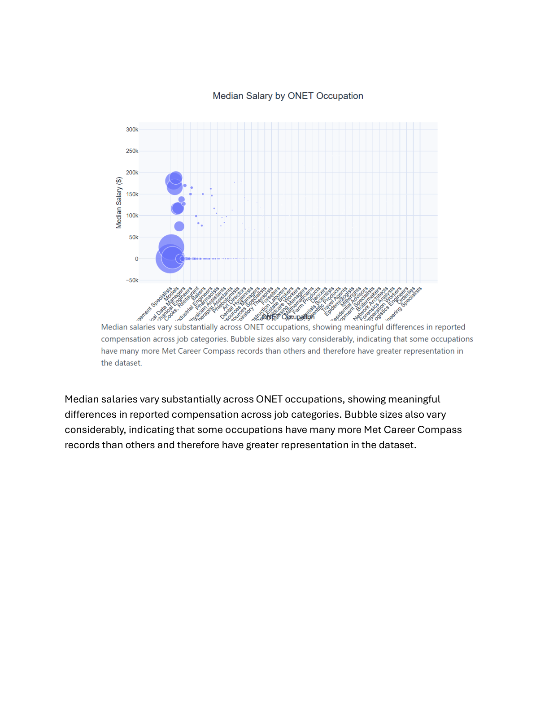
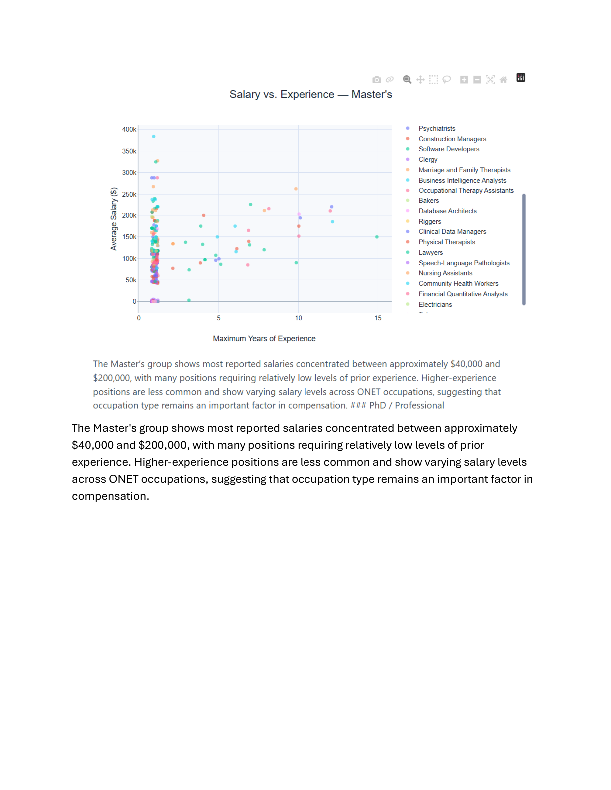

# My Projects

This portfolio highlights selected academic and technical projects that demonstrate my experience with data analytics, visualization, cloud computing, and business intelligence.

## Marketing Analytics

### Data Analysis and Visualization

For a marketing analytics project, I worked with a dataset to analyze visitor activity, purchases, revenue, labor hours, weather conditions, customer complaints, and other business factors.

The project involved:

- Cleaning and preparing data
- Exploring relationships between variables
- Analyzing business trends
- Creating visualizations
- Using Tableau to communicate findings
- Developing insights that could support business decisions

**Skills:** Data Analysis · Tableau · Data Visualization · Business Analytics

---

## Big Data & Cloud Analytics

### AWS Cloud Computing

Through my Big Data and Cloud Analytics coursework, I have developed foundational knowledge of cloud computing and AWS services.

Topics and technologies include:

- Amazon EC2
- Amazon S3
- Amazon DynamoDB
- Amazon RDS
- Amazon Redshift
- AWS Lambda
- Amazon CloudWatch
- AWS CloudTrail
- AWS Auto Scaling
- Elastic Load Balancing
- AWS Well-Architected Framework

These projects have helped me understand how cloud technologies can be used to build scalable, reliable, and cost-effective business applications.

**Skills:** AWS · Cloud Computing · Databases · Scalability · Cloud Architecture

---

## Machine Learning

### Machine Learning & Predictive Analytics

My coursework also introduces machine learning concepts and techniques for analyzing large datasets.

Areas of study include:

- Machine Learning
- Clustering
- Classification
- Model Evaluation
- Machine Learning Pipelines
- Spark ML

These concepts provide a foundation for applying predictive analytics to real-world business problems.

**Skills:** Machine Learning · Predictive Analytics · Spark ML · Data Science

---

## GitHub & Technical Development

### Version Control and Cloud-Based Development

I have developed experience using GitHub and Git as part of my coursework. These tools allow me to manage source code, collaborate on projects, and maintain a history of changes.

My technical development environment includes:

- GitHub
- Git
- Visual Studio Code
- Quarto
- Python
- Jupyter/Google Colab

**Skills:** GitHub · Git · Python · VS Code · Quarto

---

## Big Data Visualization

### Salary and Workforce Analysis

For a Big Data and Cloud Analytics project, I analyzed a large dataset of job postings and compensation information to explore relationships between salary, industry, occupation, experience, education, and work arrangement.

The project focused on using data visualization to communicate patterns within a large dataset and demonstrate how analytical findings can support business and workforce decisions.

The analysis included:

- Comparing salary distributions across industries and employment types
- Examining median salaries across occupations
- Analyzing the relationship between salary and years of experience
- Comparing salary distributions for remote, hybrid, and onsite positions
- Creating visualizations to communicate patterns and trends
- Using large-scale data visualization techniques to identify meaningful relationships

### Selected Visualizations

#### Salary and Experience — Master's Degree

This analysis explores the relationship between professional experience and salary among individuals with master's degrees.

#### Remote Salary Distribution

This visualization examines compensation patterns for remote positions and provides another perspective on how work arrangements relate to salary.

**Skills:** Big Data · Data Visualization · Python · Pandas · Data Analysis · Statistical Analysis · Business Analytics

---